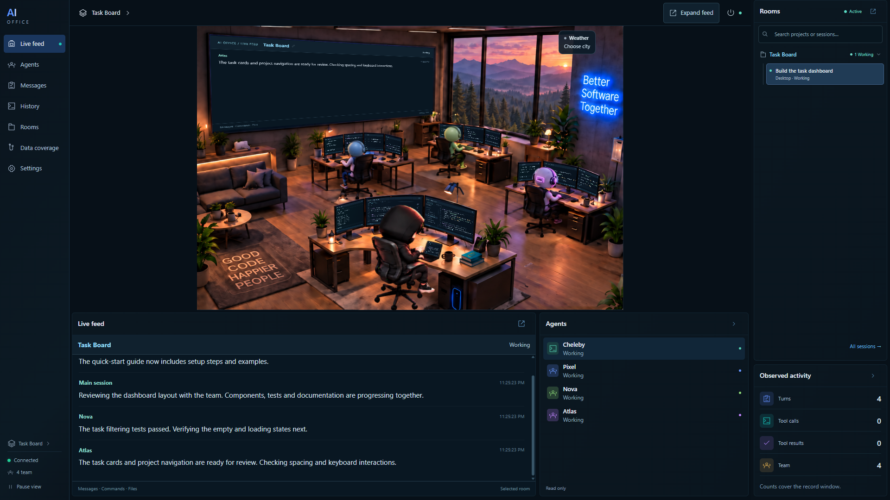

# AI Office

**Watch your Codex sessions work in a shared virtual office.**

AI Office turns local **OpenAI Codex** session activity into a fixed-camera office in your desktop browser. Each main session has its own room; its associated agents appear at their desks. See who is working, who is waiting for your answer, and what happened most recently without repeatedly switching between conversations.

[Türkçe](README.tr.md) · [MIT license](LICENSE) · [Platform verification](docs/PLATFORMS.md) · [Contributing](CONTRIBUTING.md)

[](https://github.com/chelebyy/ai-office/actions/workflows/ci.yml)



*The desktop interface with synthetic demo sessions. No private conversations or project data are shown.*

## What is it useful for?

- **Follow several projects at once.** Browse projects and their sessions, switch rooms, and keep the selected room visible after its work finishes.
- **Notice when you are needed.** Working, waiting, completed-turn, stale and disconnected states are distinguished. Visible questions and recent activity help you decide which Codex conversation to return to.
- **See the team at work.** The main character and up to three robot desks reflect their associated sessions. Larger teams remain represented in the session/event information.
- **Read recent activity.** The wall screen and expandable feed show observed tool activity and visible assistant messages. The small code/terminal monitors are decorative, activity-linked animations; they are not live IDE or terminal mirrors.
- **Make a comfortable workspace.** Fixed camera, day/night lighting, optional location-based weather, motion controls, and Turkish/English interface preferences.

AI Office is an **observer**, not an agent controller. Continue prompting and answering in Codex. Its power controls manage local observation, not Codex tasks. It does not call an LLM to create the office activity and does not provide a Codex subscription.

## Compatibility

**Built for and tested with Codex only.** Other LLMs, assistants and agent tools have not been tested. AI Office is an independent community project, not an official OpenAI product.

| Platform | Status |
| --- | --- |
| Windows | Desktop workflows verified; automated tests and builds run in CI. |
| Linux / WSL 2 | Desktop workflows verified on Ubuntu under WSL 2; automated tests and builds run on Linux in CI. |
| macOS | Compatibility not yet verified. |

See [platform verification](docs/PLATFORMS.md) for the tested environments and integration coverage.

The interface targets **desktop browsers**. Mobile use is not a supported target. Turkish and English are available; automatic language selection is a local heuristic, not general translation.

## Quick start

You need Git, **Node.js 24.13 or newer within the 24.x line**, npm, a desktop browser and local Codex session records.

```sh
git clone https://github.com/chelebyy/ai-office.git
cd ai-office
npm ci
npm run build
npm start
```

Open the URL printed in the terminal, normally **http://127.0.0.1:4317/**. Stop this manually started server with `Ctrl+C`. Install development dependencies too: the build and current runtime require them, so do not use `--omit=dev`.

### Windows launcher

After installing the prerequisites and dependencies, open `Ofisi Ac.cmd` to prepare/start the office or reuse its running server. Use `Ofisi Kapat.cmd` to stop the managed server and its recovery loop. Closing a browser tab does not stop the server.

Optional desktop shortcuts:

```powershell
powershell -ExecutionPolicy Bypass -File scripts/install-office-shortcut.ps1
powershell -ExecutionPolicy Bypass -File scripts/install-office-shortcut.ps1 -Stop
```

These create **AI Office** and **AI Office - Kapat** shortcuts.

### Linux / WSL launcher

Install Node and dependencies **inside Linux**; do not reuse Windows `node_modules`. Prefer keeping the checkout on the Linux filesystem.

```sh
sh scripts/start-office.sh --port 4327
sh scripts/start-office.sh --action status --port 4327
sh scripts/stop-office.sh --port 4327
```

Open the URL returned in the JSON response. The scripts do not install packages or open a browser. Port 4327 lets a WSL instance coexist with a Windows instance on 4317.

By default the Linux process reads its own Codex profile. To explicitly observe a Windows profile from WSL, replace `<windows-user>`:

```sh
AI_OFFICE_CODEX_HOME='/mnt/c/Users/<windows-user>/.codex' sh scripts/start-office.sh --port 4327
```

Stop the existing instance on that port before changing its source. Windows and Linux profiles are not automatically merged.

## Everyday use

1. Start Codex and work in a local session.
2. Open AI Office and select the project/session you want to follow.
3. Click a character for session details, or expand the wall feed to read recent activity.
4. If the office shows a question, return to the original Codex conversation to respond.
5. Use settings for language, motion, lighting and appearance. The power menu starts/stops/restarts observation; pausing the view only freezes its presentation.

No sessions showing? Check the selected profile path and discovery limits below. A stale or disconnected label is not proof that Codex itself stopped.

## Configuration

Use `AI_OFFICE_*` variables. The corresponding legacy `CHELEBY_*` aliases still work when the new variable is empty or unset. A non-empty new variable takes precedence; launcher port arguments override both.

| Variable | Default | Purpose |
| --- | --- | --- |
| `AI_OFFICE_CODEX_HOME` | `CODEX_HOME`, otherwise `~/.codex` | Profile root containing the `sessions` directory. |
| `AI_OFFICE_PORT` | `4317` | Local port, 1024–65535. |
| `AI_OFFICE_RECENT_DAYS` | `7` | Initial discovery window in creation days, 1–366. Increase it for older sessions. |
| `AI_OFFICE_MAX_FILES` | `60` | Selected recent-file limit, 1–250. |
| `AI_OFFICE_POLL_MS` | `1500` | Incremental polling interval, 500–30000 ms. |

PowerShell example:

```powershell
$env:AI_OFFICE_CODEX_HOME = 'D:\CodexProfile'
npm start
```

## Data and limitations

- The observer reads local records and does not send commands to Codex. The web server binds to `127.0.0.1` with local cookie/origin checks.
- Session data stays in the local observer/browser flow. Optional city search and weather use Open-Meteo: those requests include the search query or selected coordinates, not session records.
- Raw user messages, internal reasoning and full tool inputs/outputs are not forwarded to the browser. Visible questions, assistant messages and bounded activity previews may still contain private information. Redaction is not complete anonymization; review the display before sharing screenshots.
- Counters cover the records actually read. Large files initially use metadata plus a bounded tail; each session retains up to 120 recent events and 16,000 characters of recent assistant text. Historical discovery is incremental, so large archives may need several polls to discover an old resumed session. History is reconstructed after restart, not stored in a separate persistent database.
- A completed turn does not mean a closed session. The application does not infer cost, test success, percentage completion or the model's internal reasoning.
- Codex record formats can change. Other LLM integrations, macOS and all Linux distributions are not claimed as supported.

## Development

```sh
npm run dev
npm run check
```

Development hot reload is disabled: refresh for web changes and restart for observer changes. `npm run check` runs repository privacy checks, TypeScript, behavioral tests and the production build.

The `test/` directory contains automated regression tests for session parsing, observation, local server security, launchers and interface behavior. Test helpers and sample records exercise these features without requiring your Codex history.

CI runs on Windows and Linux for pull requests and default-branch changes. Version tags trigger the same checks before publishing a GitHub source release. This local application is not deployed to a hosted server.

- [Architecture](docs/ARCHITECTURE.md)
- [Platform verification and limits](docs/PLATFORMS.md)
- [Privacy and data handling](docs/PRIVACY.md)
- [Security reporting](SECURITY.md)
- [Contribution and release process](CONTRIBUTING.md)

## License

[MIT](LICENSE). You may use, copy, modify, redistribute and sell the project, including in commercial and closed-source products, while retaining the copyright and license notice. No warranty is provided. Third-party dependencies retain their own licenses.
